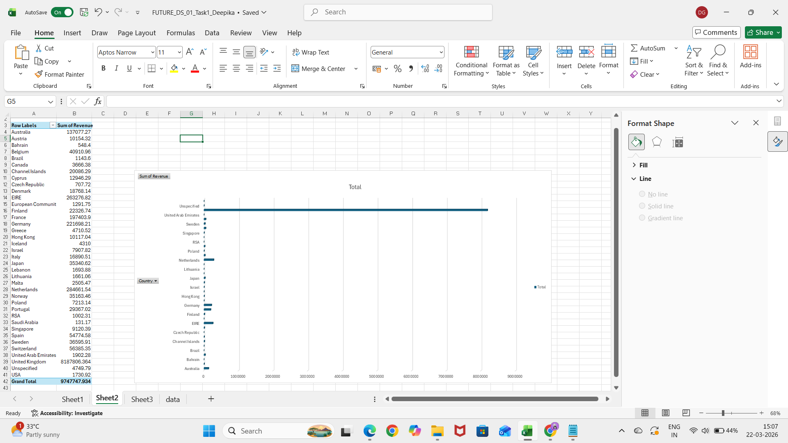
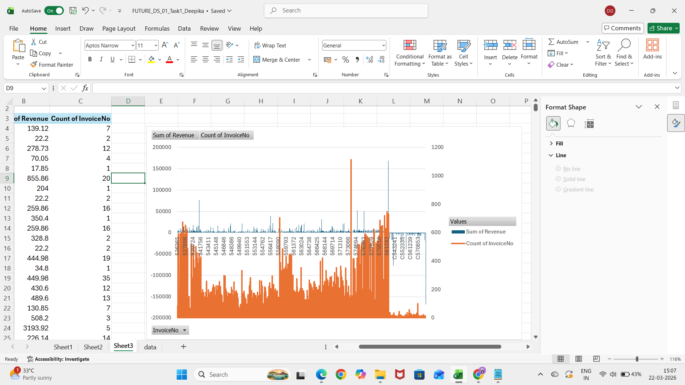

# Task 1 – Business Sales Performance Analytics

This repository contains the analysis and dashboard for **Task 1** of the **Data Science & Analytics Internship** at Future Interns.

## Tools Used
- Microsoft Excel (Pivot Tables & Charts)

## Charts Included

1. **Monthly Sales Trend**  
   Revenue trend over time (Line chart)  
   

2. **Top 10 Best-Selling Products**  
   Bar chart of top products by revenue  
   

3. **Country / Region Sales**  
   Bar chart showing revenue by region  
   

4. **Orders vs Revenue**  
   Combo chart to show revenue per order  
   

## Key Insights

- **Monthly Revenue Peaks:** [Insert month(s) with highest revenue]  
- **Top-Selling Products:** [Insert Product A, Product B, Product C]  
- **Highest Revenue Regions:** [Insert Region X, Region Y]  
- **Orders vs Revenue Trend:** [Insert pattern, e.g., revenue generally increases with order count, exceptions, etc.]  

## Deliverables

- Client-ready Excel dashboard  
- Business insights and actionable recommendations

## File Included

- `FUTURE_DS_01_Task1_Deepika.xlsx` – Excel dashboard with all charts  
- PNG screenshots for quick view: `Monthly_Sales_Trend.png`, `Top_10_Products.png`, `Region_Sales.png`, `Orders_vs_Revenue.png`
